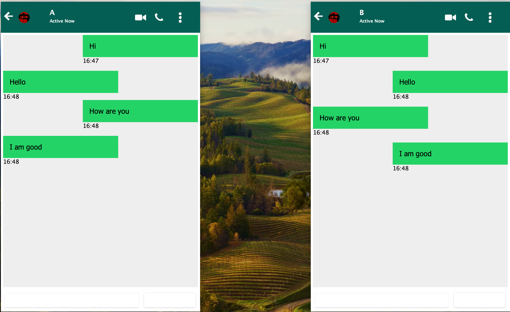

# JavaChatApplication

A simple Java Swing-based chat application featuring client and server for real-time messaging over a local network. The user interface includes custom icons, profile images, and message formatting.

## Features

- Real-time messaging between two users
- Custom icons and profile images
- Message formatting with timestamps
- Modern chat UI using Java Swing
- Socket programming for network communication

## Topics

- Java Swing GUI design
- Socket programming (TCP)
- Event handling in Java
- Message alignment and formatting

## Getting Started

### Prerequisites

- Java 8 or higher
- IntelliJ IDEA or any Java IDE

## Simple UI of the Application


### Running the Application

1. Clone the repository:
   ```sh
   git clone https://github.com/Mrunal003/JavaChatApplication.git